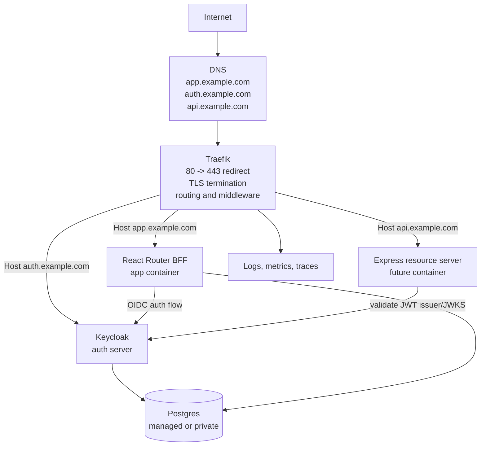

# Traefik Guide For This Application

This guide explains what Traefik is, how this repository currently uses it, and
which Traefik features are useful as the app moves from local testing toward a
production deployment.

The repo currently pins `traefik:v3.2` in `api-gateway/docker-compose.yml`.
The feature notes below are based on Traefik v3 documentation. Before enabling
a new option, confirm it exists in the pinned image or upgrade Traefik
deliberately.

## What Traefik Is

Traefik is an edge proxy and load balancer. It sits in front of backend
services, receives traffic from browsers or API clients, and decides which
internal service should handle each request.

For this application, Traefik is the public front door for:

- the React Router app, currently served by the `app` container on port `3000`
- Keycloak, currently served by the `keycloak` container on port `8080`
- a future Express resource server, served by an `api-express` container on port
  `8001`

Traefik lets browser clients use clean hostnames such as `app.localhost`,
`auth.localhost`, and eventually `api.localhost` instead of internal container
names and ports. In production, the same model becomes
`https://app.example.com`, `https://auth.example.com`, and later
`https://api.example.com`.

## Current Local Architecture

The local Traefik service is defined in `api-gateway/docker-compose.yml`.
Gateway-mode Postgres, auth, and web services are defined in
`postgres/docker-compose.gateway.yml`, `auth-server/docker-compose.gateway.yml`,
and `web/docker-compose.gateway.yml`.

```mermaid
flowchart LR
  browser[Browser]
  traefik[Traefik<br/>ports 80 and 8081]
  app[React Router app<br/>app:3000]
  keycloak[Keycloak<br/>keycloak:8080]
  api[Express API<br/>future api-express:8001]
  postgres[(Postgres<br/>private network)]

  browser -->|http://app.localhost| traefik
  browser -->|http://auth.localhost| traefik
  browser -. future .->|http://api.localhost| traefik
  browser -->|http://localhost:8081<br/>local dashboard only| traefik

  traefik -->|Host app.localhost| app
  traefik -->|Host auth.localhost| keycloak
  traefik -. future Host api.localhost .-> api
  app -. OIDC redirects and token exchange .-> keycloak
  api -. validate JWT issuer/JWKS .-> keycloak
  keycloak --> postgres
  api -. app data .-> postgres

  subgraph public_network[public Docker network]
    traefik
    app
    keycloak
    api
  end

  subgraph postgres_network[private Postgres Docker network]
    keycloak
    api
    postgres
  end
```

Key points in the current local stack:

- Traefik listens on port `80` for browser traffic.
- The app is exposed at `http://app.localhost`.
- Keycloak is exposed at `http://auth.localhost`.
- The future Express service should be exposed at `http://api.localhost` once
  the `api-express` container exists. `http://api-express.localhost` is
  reserved as an alternative host so both can be routed at once.
- The Traefik dashboard is exposed at `http://localhost:8081`.
- Postgres is not published to the host and is only on the private Docker
  network.
- Services are not exposed by default. Each public service must opt in with
  `traefik.enable=true`.
- The stack is local HTTP only. It is useful for production-like routing, but it
  is not a hardened production proxy.

When the Express container is added, keep the same label pattern as the app and
Keycloak services:

```yaml
labels:
  - traefik.enable=true
  - traefik.docker.network=admin-starter-public
  - traefik.http.routers.api.rule=Host(`api.localhost`)
  - traefik.http.routers.api.entrypoints=web
  - traefik.http.services.api.loadbalancer.server.port=8001
```

See [../api-gateway/README.md](../api-gateway/README.md) for the Express route
labels.

## Production Target Architecture

In production, Traefik should terminate HTTPS, redirect HTTP to HTTPS, protect
the dashboard, and route only the intended public services.



## Core Traefik Concepts

### Static Configuration

Static configuration controls Traefik itself: entrypoints, providers, logs,
dashboard/API, certificate resolvers, and global settings. In this repo, static
configuration is currently passed as command-line arguments under the
`api-gateway` Traefik service:

```yaml
command:
  - --api.dashboard=true
  - --api.insecure=true
  - --entrypoints.web.address=:80
  - --providers.docker=true
  - --providers.docker.exposedbydefault=false
```

For production, static configuration should add a `websecure` entrypoint on
port `443`, an ACME certificate resolver, access logs, and a secured dashboard
route.

### Dynamic Configuration

Dynamic configuration tells Traefik how to route requests to services. This can
come from Docker labels, files, Kubernetes resources, Consul, ECS, Nomad, and
other providers.

This repo uses the Docker provider. The app and Keycloak containers declare
labels such as:

```yaml
labels:
  - traefik.enable=true
  - traefik.http.routers.app.rule=Host(`${APP_HOST}`)
  - traefik.http.routers.app.entrypoints=web
  - traefik.http.services.app.loadbalancer.server.port=3000
```

That label set means:

- expose this container to Traefik
- create an HTTP router named `app`
- match requests whose `Host` header equals the configured app host
- accept traffic from the `web` entrypoint
- forward matching traffic to port `3000` inside the app container

### EntryPoints

EntryPoints are the network sockets Traefik listens on. Common ones are:

- `web` on `:80` for HTTP
- `websecure` on `:443` for HTTPS
- `traefik` on `:8080` for the internal API/dashboard entrypoint when enabled
- `metrics` on `:9100` if exposing metrics separately

For production, keep ports `80` and `443` public. Do not publish app, Keycloak,
API, or Postgres ports directly unless there is a specific operational reason.

### Routers

Routers match incoming requests and attach middleware before forwarding to a
service. Common router rules include:

- `Host(`app.example.com`)`
- `Host(`api.example.com`) && PathPrefix(`/v1`)`
- `PathPrefix(`/api`)`
- `ClientIP(`203.0.113.0/24`)`

For this app, host-based routing is the clearest production shape:

- `app.example.com` routes to React Router
- `auth.example.com` routes to Keycloak
- `api.example.com` routes to the Express API when it exists

### Services

Services are Traefik's representation of backend targets. With Docker labels,
the service usually points at a container port:

```yaml
- traefik.http.services.app.loadbalancer.server.port=3000
```

Traefik can load balance across multiple instances of the same service. It can
also use health checks, sticky sessions, weighted services, mirroring, and
failover patterns depending on provider and configuration style.

### Middlewares

Middlewares run after a router matches and before the request reaches the
backend service. They are the main way to add proxy-level behavior without
changing application code.

Useful middleware categories for this app:

- Security: `Headers`, `IPAllowList`, `RateLimit`, `InFlightReq`,
  `BasicAuth`, `ForwardAuth`, `PassTLSClientCert`
- Request lifecycle: `RedirectScheme`, `Retry`, `CircuitBreaker`, `Buffering`
- Path handling: `StripPrefix`, `AddPrefix`, `ReplacePath`,
  `ReplacePathRegex`
- Response handling: `Compress`, `Errors`
- Composition: `Chain` to group common middleware in one reusable unit

Middleware order matters. If a router lists `auth,ratelimit,headers`, Traefik
applies them in that order.

## What Traefik Should Do For This App

### 1. Public Routing

Traefik should own the public URL map:

```text
https://app.example.com  -> React Router app container
https://auth.example.com -> Keycloak container
https://api.example.com  -> Express container, once added
```

Keep route ownership simple. React Router owns app routes after the request
reaches the app. Keycloak owns identity pages and OIDC endpoints. The future API
owns API paths. Traefik only decides which service receives the request.

### 2. TLS Termination

In production, Traefik should terminate TLS at the edge. Backend containers can
continue speaking HTTP over a private Docker network unless the deployment
requires end-to-end TLS.

Recommended production capabilities:

- listen on `:80` and `:443`
- redirect all HTTP traffic to HTTPS
- use Let's Encrypt ACME for automatic certificates
- persist `acme.json` across restarts
- use Let's Encrypt staging while testing certificate setup
- set production app and Keycloak URLs to `https://...`

Example production static configuration pattern:

```yaml
command:
  - --entrypoints.web.address=:80
  - --entrypoints.websecure.address=:443
  - --entrypoints.web.http.redirections.entrypoint.to=websecure
  - --entrypoints.web.http.redirections.entrypoint.scheme=https
  - --certificatesresolvers.letsencrypt.acme.email=ops@example.com
  - --certificatesresolvers.letsencrypt.acme.storage=/letsencrypt/acme.json
  - --certificatesresolvers.letsencrypt.acme.httpchallenge=true
  - --certificatesresolvers.letsencrypt.acme.httpchallenge.entrypoint=web
  - --providers.docker=true
  - --providers.docker.exposedbydefault=false
```

Example production router labels:

```yaml
labels:
  - traefik.enable=true
  - traefik.http.routers.app.rule=Host(`app.example.com`)
  - traefik.http.routers.app.entrypoints=websecure
  - traefik.http.routers.app.tls.certresolver=letsencrypt
  - traefik.http.services.app.loadbalancer.server.port=3000
```

### 3. Forwarded Headers

Traefik adds common forwarded headers such as `X-Forwarded-For`,
`X-Forwarded-Host`, and `X-Forwarded-Proto`. Keycloak needs proxy-aware
configuration so it generates correct public URLs behind Traefik.

The local Traefik stack already sets:

```env
KC_PROXY_HEADERS=xforwarded
KC_HOSTNAME=${KEYCLOAK_EXTERNAL_URL}
KC_HTTP_ENABLED=true
```

For production, keep Keycloak's hostname pointed at the public HTTPS auth URL,
for example:

```env
KC_HOSTNAME=https://auth.example.com
KC_PROXY_HEADERS=xforwarded
KC_HTTP_ENABLED=true
```

### 4. Security Headers

Traefik can add HTTP security headers at the edge. Some headers are safe to
centralize in Traefik. Others, especially Content Security Policy, may need app
awareness because React assets, fonts, OIDC redirects, and future APIs affect
the policy.

Good candidates for Traefik:

- HSTS after HTTPS is stable
- `X-Content-Type-Options: nosniff`
- `Referrer-Policy`
- conservative frame protections for app pages
- secure custom response headers for API routes

Be careful with:

- `Content-Security-Policy`, because the app imports Google Fonts and talks to
  Keycloak
- `X-Frame-Options` on Keycloak pages, because identity providers often have
  their own frame and cookie requirements
- broad CORS headers, because Keycloak and API behavior should be explicit

Example middleware labels:

```yaml
labels:
  - traefik.http.middlewares.secure-headers.headers.stsSeconds=31536000
  - traefik.http.middlewares.secure-headers.headers.stsIncludeSubdomains=true
  - traefik.http.middlewares.secure-headers.headers.stsPreload=true
  - traefik.http.middlewares.secure-headers.headers.contentTypeNosniff=true
  - traefik.http.middlewares.secure-headers.headers.referrerPolicy=no-referrer
  - traefik.http.routers.app.middlewares=secure-headers
```

Enable HSTS only after HTTPS is working reliably on all affected subdomains.

### 5. Rate Limiting And Abuse Reduction

Traefik's `RateLimit` middleware can reduce noisy clients before requests reach
the app, Keycloak, or the future API.

Useful places:

- `/auth/*` app endpoints if public abuse becomes an issue
- `api.example.com` once the Express API exists
- Keycloak public endpoints, but with careful testing to avoid breaking normal
  login flows

Example:

```yaml
labels:
  - traefik.http.middlewares.app-ratelimit.ratelimit.average=100
  - traefik.http.middlewares.app-ratelimit.ratelimit.period=1s
  - traefik.http.middlewares.app-ratelimit.ratelimit.burst=200
  - traefik.http.routers.app.middlewares=app-ratelimit,secure-headers
```

For multi-instance Traefik deployments, local in-memory rate limits may not be
enough. Use a distributed strategy supported by the deployed Traefik version, or
keep only one Traefik instance at the edge.

### 6. Dashboard Protection

The current local stack uses:

```yaml
- --api.dashboard=true
- --api.insecure=true
```

That is acceptable for local testing only. Do not expose `api.insecure=true` on
a public host.

Production options:

- disable the dashboard entirely
- expose it only on a private network or VPN
- route it through `api@internal` with `BasicAuth`, `IPAllowList`, or
  `ForwardAuth`
- log dashboard access

Example idea:

```yaml
labels:
  - traefik.http.routers.traefik.rule=Host(`traefik.example.com`) && (PathPrefix(`/api`) || PathPrefix(`/dashboard`))
  - traefik.http.routers.traefik.entrypoints=websecure
  - traefik.http.routers.traefik.tls.certresolver=letsencrypt
  - traefik.http.routers.traefik.service=api@internal
  - traefik.http.routers.traefik.middlewares=dashboard-auth,dashboard-allowlist
```

### 7. Network Isolation

Traefik should be on a public-facing Docker network with only the services it
must reach. Databases should stay on private networks.

The local Traefik stack follows this shape:

- `traefik` is on the shared `admin-starter-public` network
- `app` is on `public` and `private`
- `keycloak` is on `public` and `private`
- `postgres` is on `private` only
- `private` is marked `internal: true`

This is the right direction for production. Strengthen it by avoiding published
container ports for app, Keycloak, API, and Postgres.

### 8. Docker Socket Risk

The Docker provider usually needs access to the Docker API so Traefik can watch
container labels. This repo mounts the Docker socket read-only:

```yaml
volumes:
  - /var/run/docker.sock:/var/run/docker.sock:ro
```

Read-only is better than read-write, but Docker socket access is still highly
sensitive. In production, consider:

- limiting Traefik to a dedicated Docker host or VM
- using a Docker socket proxy that exposes only required API endpoints
- using file provider configuration for static routes instead of broad Docker
  discovery
- setting `providers.docker.exposedbydefault=false`, which this repo already
  does
- using provider constraints if the host runs unrelated containers

### 9. Observability

Traefik can provide visibility at the edge before traffic reaches the app.

Useful options:

- Traefik logs for startup and configuration events
- access logs for HTTP requests and response status
- JSON log format for ingestion into a log platform
- metrics for Prometheus, StatsD, Datadog, InfluxDB, or OpenTelemetry
- tracing for following requests through proxy and backend services
- dashboard/API for inspecting active routers, services, middlewares, and
  certificates

Recommended production baseline:

```yaml
command:
  - --log.level=INFO
  - --log.format=json
  - --accesslog=true
  - --accesslog.format=json
```

Redact or drop sensitive headers from access logs. Do not log authorization
headers, cookies, or Keycloak tokens.

### 10. Compression

Traefik's `Compress` middleware can compress eligible responses using encodings
supported by the deployed version. This can help static app assets and JSON API
responses.

Example:

```yaml
labels:
  - traefik.http.middlewares.compress.compress=true
  - traefik.http.routers.app.middlewares=secure-headers,compress
```

Use app or CDN compression instead if the hosting environment already provides
it. Avoid double-compression.

### 11. Health Checks And Load Balancing

Traefik can load balance across multiple backend instances and remove unhealthy
targets when health checks are configured. This matters when the app, API, or
Keycloak are scaled beyond one container.

For this app:

- add an app health endpoint before relying on proxy health checks
- add an Express health endpoint when the API is introduced
- be cautious scaling Keycloak without planning Postgres, cache, and session
  behavior
- use sticky sessions only when a backend truly requires affinity

### 12. Blue-Green, Canary, Mirroring, And Failover

Traefik can support more advanced release patterns:

- weighted services for canary releases
- blue-green routing by switching router targets
- mirroring selected traffic to a new API service
- failover services when a primary backend is unhealthy

For this repo, these are future features. Start with simple host-based routing,
health checks, and clean rollback by image tag. Add canary or mirroring only
when the deployment process needs it.

### 13. Path-Based API Routing

The cleanest future API shape is a separate API host:

```text
https://api.example.com
```

Path-based routing is also possible:

```text
https://app.example.com/api -> Express API
```

If using path-based routing, decide whether the API expects the `/api` prefix.
If it does not, add a `StripPrefix` middleware:

```yaml
labels:
  - traefik.http.routers.api.rule=Host(`app.example.com`) && PathPrefix(`/api`)
  - traefik.http.routers.api.entrypoints=websecure
  - traefik.http.routers.api.tls.certresolver=letsencrypt
  - traefik.http.routers.api.middlewares=api-strip-prefix,api-ratelimit
  - traefik.http.middlewares.api-strip-prefix.stripprefix.prefixes=/api
  - traefik.http.services.api.loadbalancer.server.port=8000
```

Separate hosts are usually easier for auth, cookies, CORS, and observability.

## Suggested Production Middleware Plan

Use middleware sparingly and intentionally. A good first production set is:

| Router    | Middleware            | Purpose                                        |
| --------- | --------------------- | ---------------------------------------------- |
| app       | `secure-headers`      | Browser security headers                       |
| app       | `compress`            | Compress eligible app responses                |
| app       | `app-ratelimit`       | Reduce noisy traffic                           |
| keycloak  | `auth-ratelimit`      | Carefully tested protection for auth endpoints |
| api       | `api-ratelimit`       | Protect API capacity                           |
| api       | `secure-headers`      | API security headers                           |
| dashboard | `dashboard-auth`      | Require credentials                            |
| dashboard | `dashboard-allowlist` | Restrict admin source IPs                      |

Do not put Keycloak behind app authentication middleware. Keycloak is the
identity provider and must remain reachable for login, callback, JWKS, and OIDC
metadata endpoints.

## Environment Values That Must Agree

When Traefik is involved, these values must all describe the same public
origin:

```env
APP_EXTERNAL_URL=https://app.example.com
KEYCLOAK_EXTERNAL_URL=https://auth.example.com
KEYCLOAK_ISSUER=https://auth.example.com/realms/admin-starter
WEB_AUTH_REDIRECT_URI=https://app.example.com/auth/callback
WEB_AUTH_POST_LOGIN_REDIRECT_URI=https://app.example.com/users/dashboard
WEB_AUTH_POST_LOGOUT_REDIRECT_URI=https://app.example.com
```

Keycloak client settings must match:

```text
Root URL: https://app.example.com
Home URL: https://app.example.com
Valid redirect URIs: https://app.example.com/auth/callback
Valid post logout redirect URIs: https://app.example.com/*
Web origins: https://app.example.com
```

Local Traefik testing uses the same pattern with HTTP localhost hosts:

```env
APP_EXTERNAL_URL=http://app.localhost
KEYCLOAK_EXTERNAL_URL=http://auth.localhost
API_EXTERNAL_URL=http://api.localhost
KEYCLOAK_ISSUER=http://auth.localhost/realms/admin-starter
WEB_AUTH_REDIRECT_URI=http://app.localhost/auth/callback
WEB_AUTH_POST_LOGIN_REDIRECT_URI=http://app.localhost/users/dashboard
WEB_AUTH_POST_LOGOUT_REDIRECT_URI=http://app.localhost
```

`API_EXTERNAL_URL` is the intended local value for the future Express service.
It is not used by the current Compose stack until an `api` service is added.

## Common Failure Modes

### Login Redirects To The Wrong Host

Check:

- `KEYCLOAK_ISSUER`
- `WEB_AUTH_REDIRECT_URI`
- Keycloak client redirect URI settings
- `KC_HOSTNAME`
- `KC_PROXY_HEADERS`
- whether the browser is using the Traefik hostname instead of direct ports

### Secure Cookie Is Not Set Locally

The app marks the session cookie `Secure` when `NODE_ENV=production`. For local
HTTP Traefik testing, keep:

```env
APP_NODE_ENV=development
```

Use `production` only with HTTPS.

### Traefik Returns 404

Traefik returns 404 when no router matches. Check:

- DNS or hosts file points to the Traefik host
- request `Host` matches the router rule
- service has `traefik.enable=true`
- service is attached to the same Docker network Traefik uses
- `traefik.docker.network` references the correct network name
- router entrypoint matches the port being used

### Backend Is Unreachable

Check:

- backend container is healthy and listening on the expected internal port
- `loadbalancer.server.port` matches the container port, not the host port
- service and Traefik share a Docker network
- backend is not bound only to `127.0.0.1` inside the container

### Certificates Do Not Issue

Check:

- DNS points to the Traefik host
- port `80` is reachable for HTTP-01 or port `443` for TLS-ALPN-01
- the router references the certificate resolver
- `acme.json` is persisted across restarts
- Let's Encrypt staging is used during experiments
- rate limits have not been hit

## Local Commands

Start the local Traefik test stack:

```bash
corepack pnpm dev:gateway
```

Open:

```text
http://app.localhost
http://auth.localhost
http://api.localhost
http://localhost:8081
```

`http://api.localhost` will return a Traefik 404 until the Express container and
router labels are added.

View logs:

```bash
corepack pnpm gateway:logs
```

Stop:

```bash
corepack pnpm dev:gateway:down
```

Reset local Traefik data:

```bash
docker compose -f auth-server/docker-compose.gateway.yml --env-file .env.traefik down
docker compose -f postgres/docker-compose.gateway.yml --env-file .env.traefik down -v
```

## Production Readiness Checklist

- Use `web` and `websecure` entrypoints.
- Redirect HTTP to HTTPS.
- Persist ACME certificate storage.
- Use Let's Encrypt staging before production ACME.
- Set `APP_NODE_ENV=production` only after HTTPS is active.
- Use HTTPS public URLs in app and Keycloak env vars.
- Keep `providers.docker.exposedbydefault=false`.
- Do not publish Postgres publicly.
- Do not publish app, API, or Keycloak direct ports publicly.
- Disable `api.insecure=true`.
- Protect or disable the Traefik dashboard.
- Add access logs with sensitive header redaction.
- Add security headers after testing app and Keycloak behavior.
- Add rate limits conservatively and test login flows.
- Add app/API health endpoints before depending on proxy health checks.
- Document DNS, certificate, backup, and rollback procedures.

## References

- Traefik docs: <https://doc.traefik.io/traefik/>
- Providers overview:
  <https://doc.traefik.io/traefik/reference/install-configuration/providers/overview/>
- Docker provider:
  <https://doc.traefik.io/traefik/v3.3/providers/docker/>
- HTTP routers:
  <https://doc.traefik.io/traefik/v3.5/reference/routing-configuration/http/routing/router/>
- HTTP middleware overview:
  <https://doc.traefik.io/traefik/v3.5/reference/routing-configuration/http/middlewares/overview/>
- ACME and Let's Encrypt:
  <https://doc.traefik.io/traefik/v3.4/https/acme/>
- API and dashboard:
  <https://doc.traefik.io/traefik/v3.5/reference/install-configuration/api-dashboard/>
- Logs and access logs:
  <https://doc.traefik.io/traefik/v3.5/reference/install-configuration/observability/logs-and-accesslogs/>
- HTTP services and load balancing:
  <https://doc.traefik.io/traefik/v3.5/reference/routing-configuration/http/load-balancing/service/>
- Keycloak securing applications and services:
  <https://www.keycloak.org/docs/25.0.6/securing_apps/index.html>
- Existing deployment runbook:
  [production-deployment.md](production-deployment.md)
- Auth server infrastructure notes:
  [../auth-server/README.md](../auth-server/README.md)
